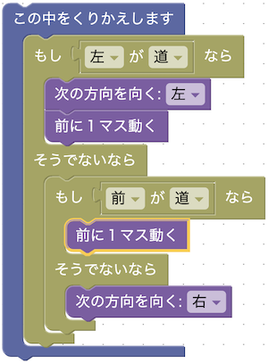
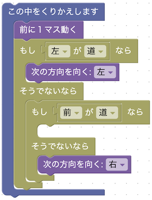

# STAGE9 うずまき
## 想定解法

- 使用ブロック数：9
- クリア時の残り体力:266

## ステージの狙い
「左側のかべに手を置いて進む」という迷路にありがちな解き方を、どのようにブロックに落とし込むかについて考えてもらうことで、コードに落とし込む力を養ってもらおうという狙いがあります。
以下のようなブロックの組み方（一つブロックが少ない）でもクリアすることができますが、真ん中の行き止まり部分で壁に向かって無駄に歩いてしまうので残り体力が226になり、星2つでのクリアになってしまいます
